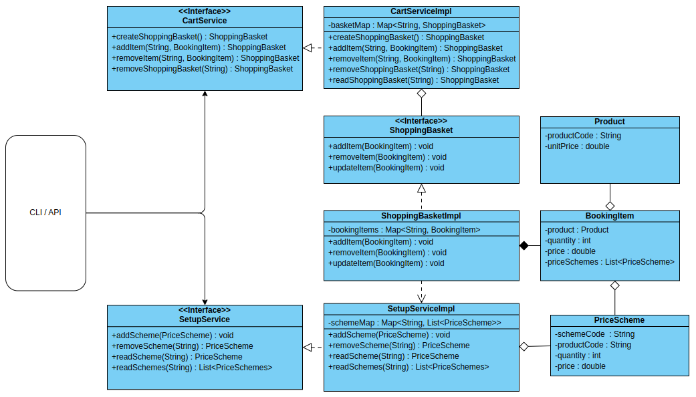

Introduction
-
- This is a basic java implementation of a supermarket checkout system. 
- The system accepts letters of alphabet to uniquely identify products and manage inventories rather than conventional Stock Keeping Unit(SKU). 
- This system specially provides discount pricing schemes to handle multi-price items.
- The system allow to update or insert new schemes before each transaction because pricing can change frequently.
- For instance, below table depicts a sample pricing scheme setup. 

| Product | Unit price | Special Price |
|---------|------------|---------------|
| A       | 50         | 3 for 130     |
| B       | 30         | 2 for 45      |
| C       | 20         ||
| D       | 15         ||

- The running total price changes as below after applying above schemes.

| Iteration | Product | Quantity | Running Total Price | Explanation |
|-----------|---------|----------|---------------------|-------------|
| 1         | A       | 2        | 100                 | 2*50        |
| 2         | B       | 1        | 130                 | 2*50 + 30   |
| 3         | A       | 1        | 160                 | 130 + 30    |
| 4         | B       | 1        | 175                 | 130 + 45    |
| 5         | B       | 2        | 215                 | 130 + 2*45  |

UML Diagram
-

Technical details
-
- This project is written in JDK 17.
- This project used SLF4J abstraction with LOG4J2 implementation for logging purpose.  By default, two logger appenders 
are setup in the configuration file, one for console and other for file.

Instruction for execution
-
| command                                               | description                                |
|-------------------------------------------------------|--------------------------------------------|
| mvn clean                                             | clean the project(remove target directory) |
| mvn build                                             | build the project                          |
| mvn package                                           | packaging into jar                         |
| java -cp supermarket-checkout-system.jar org.cdl.Main | execute the jar in the target directory    |

Further improvements
-
- Implement REST API with spring boot to create a self-executable web application.
- Integrate SQL database to store setup rules and persist shopping basket.
